## Biodiversidade e Mudanças Climáticas

:::{.columns}
:::{.column}
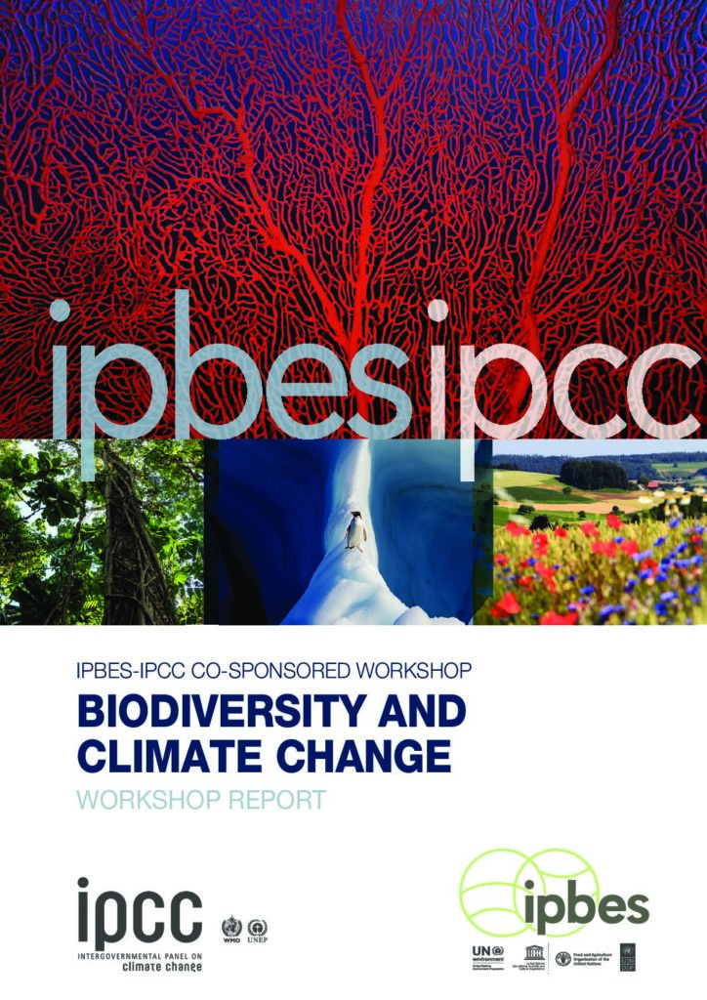
:::

:::{.column}
- O termômetro mais preciso da MC
- Múltiplos efeitos sobre o bem-estar humano
- Necessita dados robustos
:::
:::
:::

##

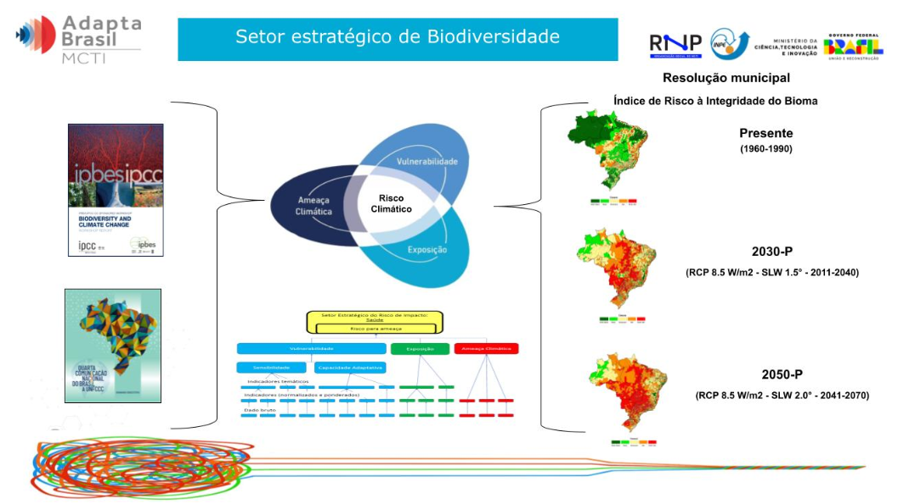

##

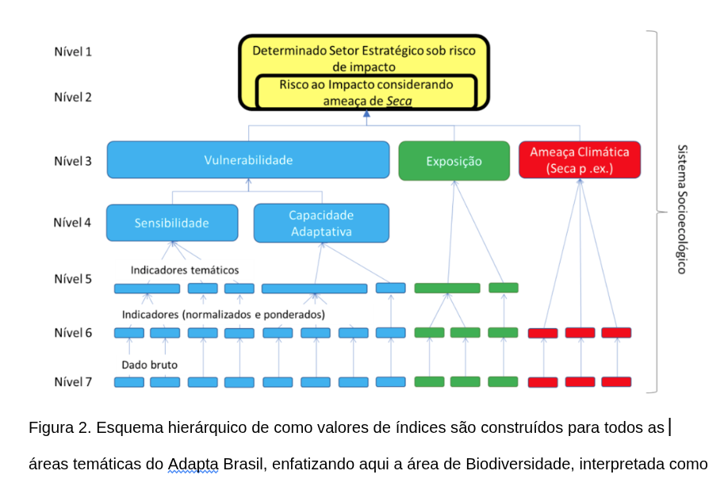

## Lacunas de biodiversidade

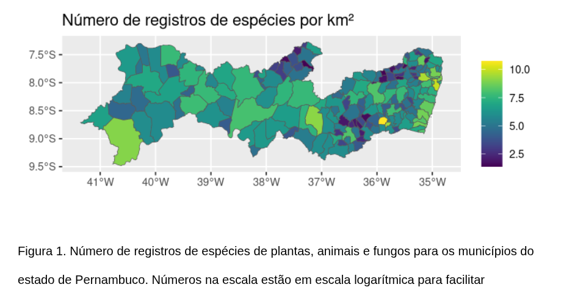

## Análise de Vulnerabilidade  

$$ Vulnerabilidade = Sensibilidade + Eposilção - Capac Adapt $$ 

## Sensibilidade

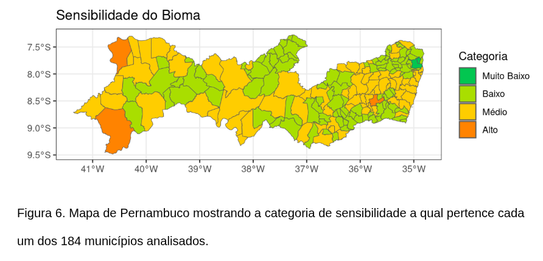

## Como interpretar os dados?

:::{.columns}
:::{.column}

- **Indicador temático**
  - **Indicadores**
    - Dados brutos
    
:::
:::{.column}

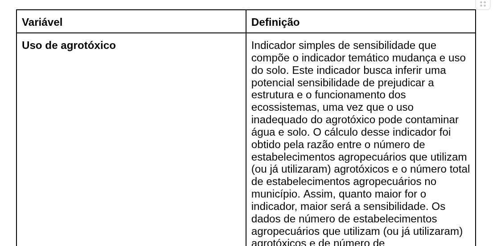

:::
:::

## Indicadores de sensibilidade{.center}

## Mudança e uso do solo

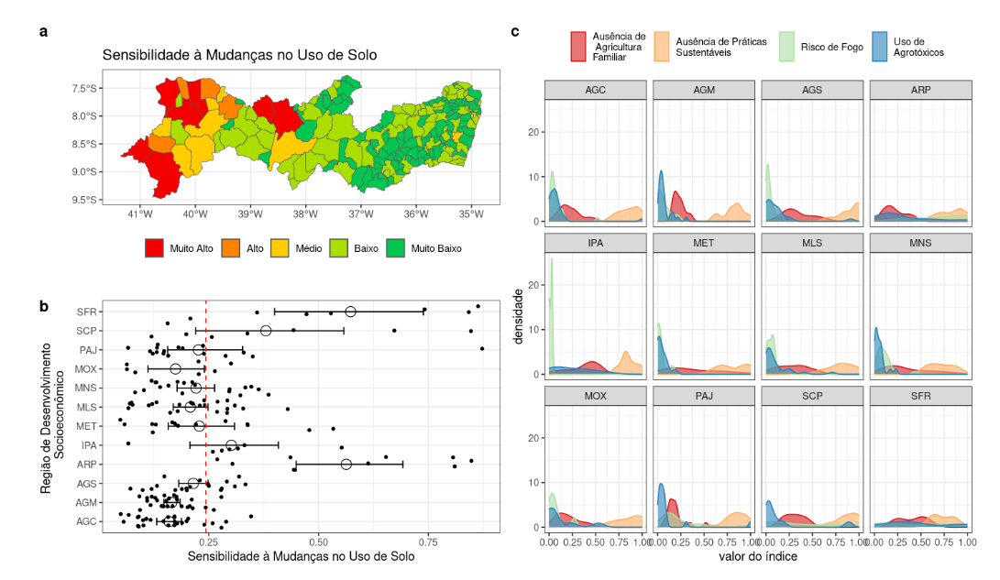{fig-align="center"}

## Cobertura do solo

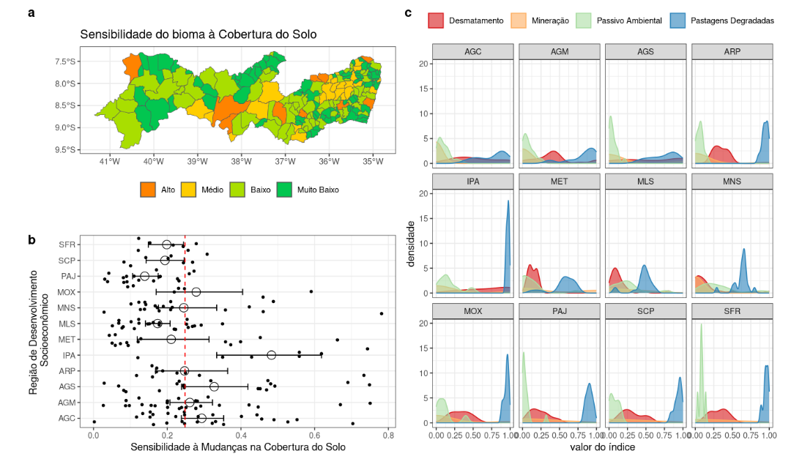{fig-align="center"}

## Densidade populacional e de estabelecimentos

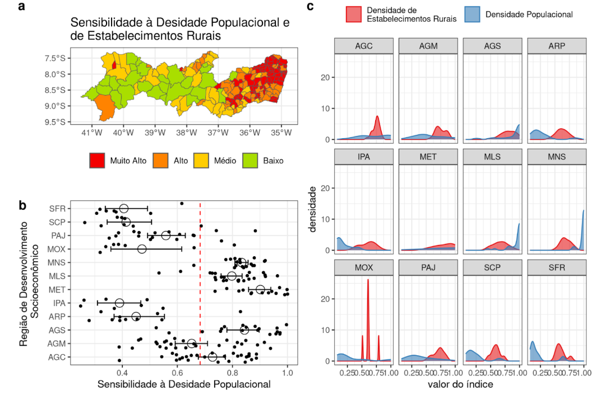{fig-align="center"}

## Infraestrutura

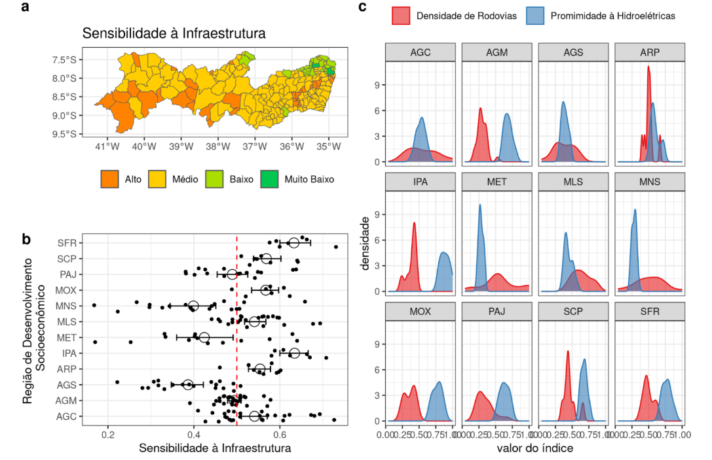{fig-align="center"}

## Capacidade Adaptativa{.center}

## Capacidade Adaptativa 

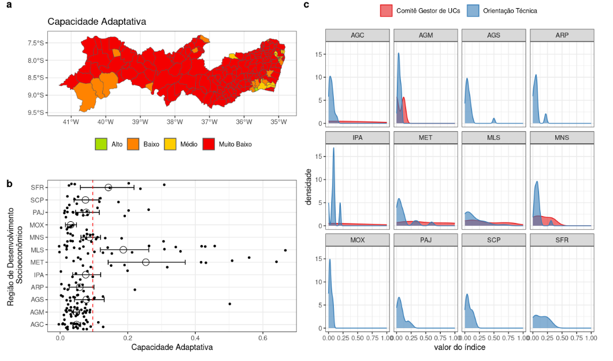{fig-align="center"}

## Exposição {.center}

## Cobertura natural exposta 

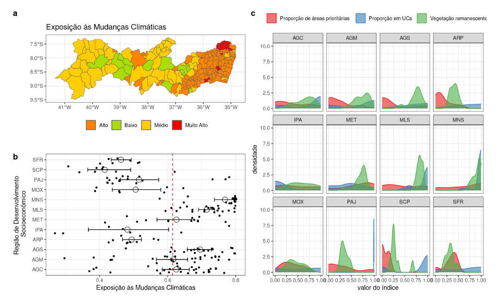{fig-align="center"}

## Vulnerabilidade{.center}

##  Vulnerabilidade = Exp + Sens - Capc

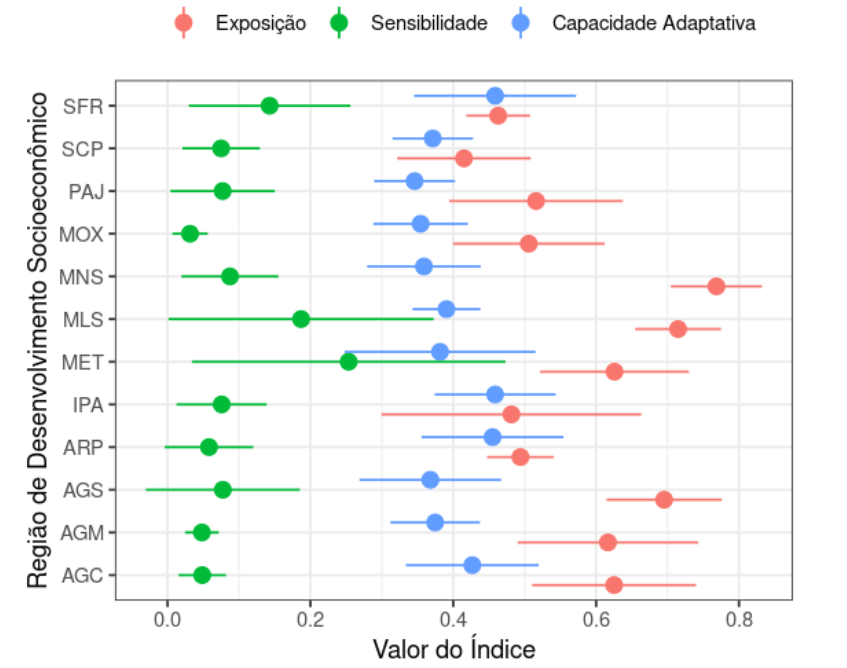{fig-align="center"}

## Índice de Ameaça Climática aos Biomas{.center}
Dados climáticos (precipitação, temperatura, etc...)

## Ameaça à integridade dos Biomas 

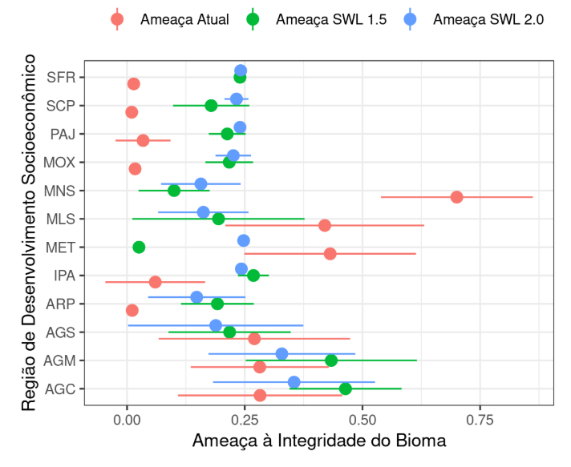{fig-align="center"}

## Índice de Risco Climático aos Biomas{.center}
Dados de Vulnerabiliade, Exposilção, Capacidade Adaptativa, etc...

## Risco à integridade dos Biomas

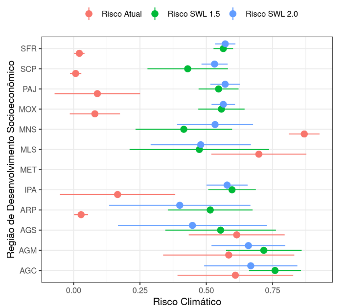{fig-align="center"}

## Conclusões

- Pernambuco: hotspot vulnerável às MC.

- Restaurar MA e Conservar Caatinga

- Sistematizados dados sobre a biodiversidade de PE.

- Risco sobe para todo PE: maior no sertão.

- Aumentar cobertura de Unidades Conservação (UC) e sua implementação

## Obrigado{.center}

Felipe.plmelo@ufpe.br
