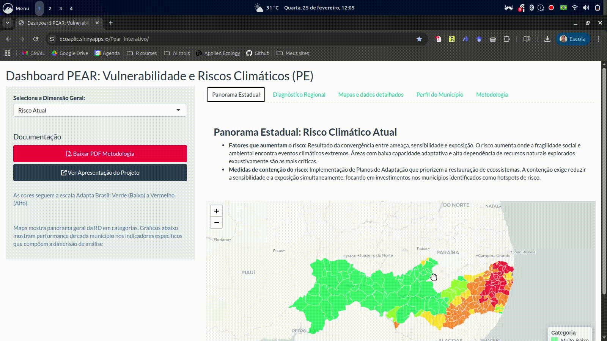
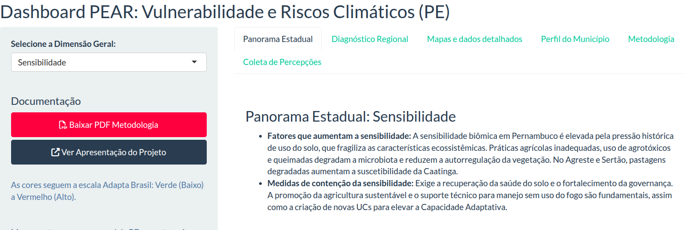
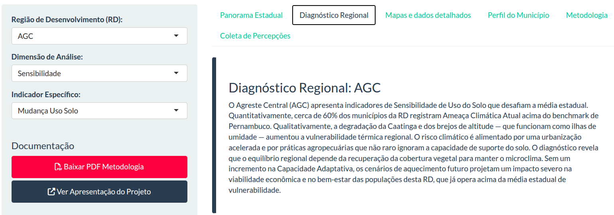
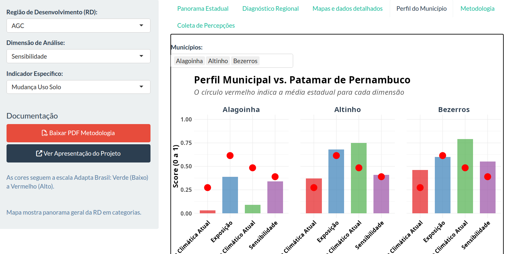
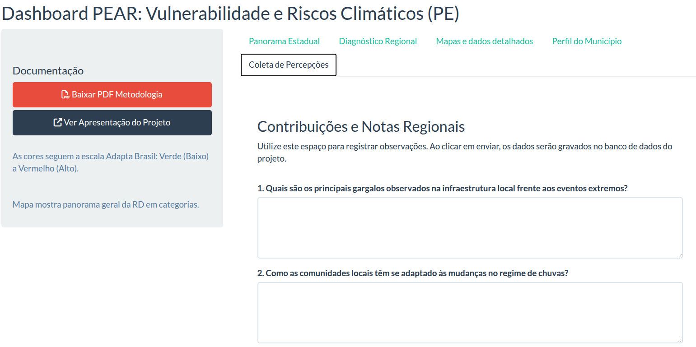

## Biodiversidade e Mudanças Climáticas

:::{.columns}
:::{.column}

:::

:::{.column}
- O termômetro mais preciso da MC
- Múltiplos efeitos sobre o bem-estar humano
- Necessita dados robustos
:::
:::
:::

## Como foi calculado?

{fig-align=center}

## Hierarquia de variáveis

{fig-align=center}

## Passo 1 -  Acesse a ferramenta online que pode ser acessada no QR-code abaixo

{fig-align=center}

## Passo 2 - Explore ferramenta

{fig-align=center}

## Aba - Panorama para PE

{fig-align=center}

** Informações gerais para o estado de PE considerando cada dimensão (sensisbilidade, exposição, etc...). Escolha dimensão e veja fatores que aumentam e medidas de contenção.**

## Aba - Diagnóstico por RD

{fig-align=center}

** Resumo geral da RD contendo pontos de destaque quanto a todoas as variáveis (positivos e negativos). Selecione a RD e veja seus resumos**

## Aba -  Mapas e Detalhes

{fig-align=center width=70%}

**Aqui você pode navegar pelas RDs, escolha a dimensão e suas variáveis para entender os riscos e ameaças de cada região e por município.**

## Aba - Perfil dos  municípios

{fig-align=center width=70%}

**Nesta aba,  você pode selecionar 1 ou + municípios para comparálos entre si ou com a média de PE (círculos vermelhos)**

## Aba - Coleta de percepções

{fig-align=center width=70%}

**Aqui você pode escrever sobre sua prórpia percepção sobre as ameaças, desaios e soluções para a biodiversidade de sua RD**

## Conclusão

- Esta é uma platadforma interativa que serve de apoio às oficinas
- É importante se familiarizar com ela e preencher suas sugestões
- Este é um trabalho em construção e é possível melhorar.

